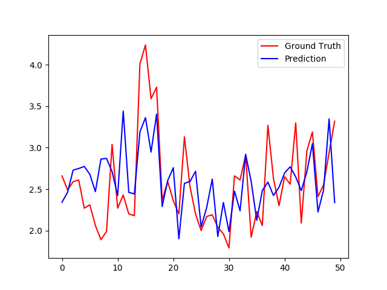

# Predicting Attractiveness using Computer Vision

## Traditional Machine Learning Approach   

Example of extracting facial features: 


Analysis with Linear Regression: 




#### Feature Generation
The features computation part of the pipeline requires the location of facial landmars of the input images. These landmarks can be generated by the [CLM-framework](https://github.com/TadasBaltrusaitis/CLM-framework). I have already included the landmarks localized using this framework in the data directory of this repo, and you can directly work with them. 

#### What's included

```
face-rating/
├── data/
│   ├── ratings.txt
│   ├── landmarks.txt
│   ├── features_ALL.txt
├── source/
│   ├── generateFeatures.py
│   └── trainModel.py
│   └── cross_validation.py
└── results/
    ├── cross_valid_predictions_knn.txt
    ├── cross_valid_predictions_gpr.txt
    ├── cross_valid_predictions_linear.txt
    ├── cross_valid_predictions_rf.txt
    └── cross_valid_predictions_svm.txt
```

#### Example Usage
```shell
python trainModel -model linear_model -featuredim 20
```
The `-featuredim` argument specifies the number of components chosen by PCA. Other supported models are Support Vector Machines (svm), Random Forests (rf), and Gaussian Process Regression (gpr). Checkout the source to change hyperparameters and other options. 

## Deep Learning Approach:

Details of the implementation can be found in the paper [`SCUT-FBP: A Benchmark Dataset for Facial Beauty Perception`](https://arxiv.org/pdf/1511.02459.pdf), the result of the creation and research on the dataset. 

[In development process]

### Requirements
1. Python 2.7
2. Numpy
3. scikit-learn

### Installing scikit-learn
Visit the official [installation page](http://scikit-learn.org/stable/install.html) for instructions.

### Dataset
The [SCUT-FBP](http://www.hcii-lab.net/data/SCUT-FBP/EN/introduce.html) dataset has been used. Please cite their research if you happen to use this dataset. The facial landmarks computer on this particular dataset are available in the `data/` directory. 

### License
MIT
